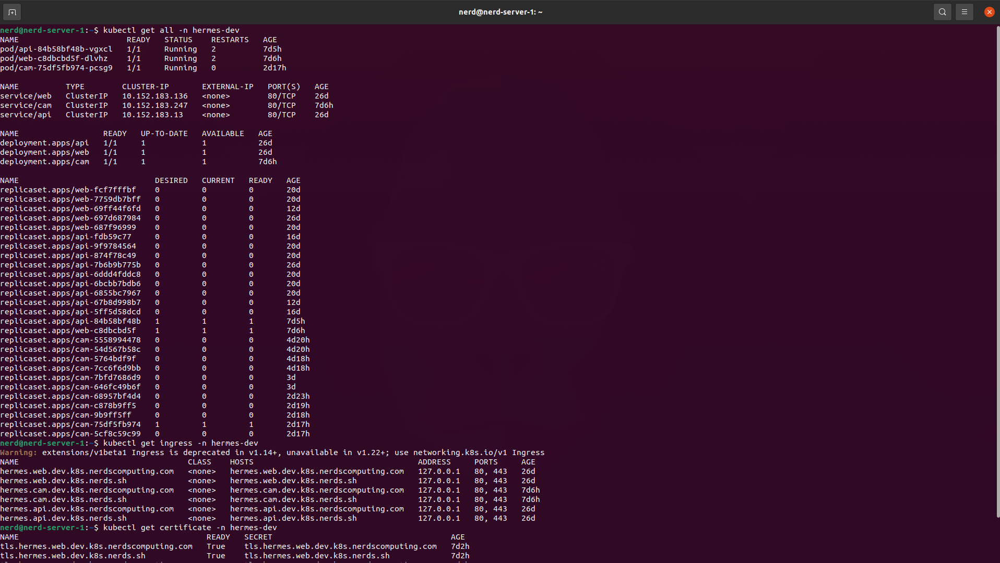

## Hermes.Charts
All the helm charts needed to deploy hermes stack on k8s.

### Requirements
Stuff needed to be met before you can proceed with deployments.

- k8s
- helm
- cert-manager
- ingress
- python3

### Help
Each python script has a help section. Be a good boy and read 
them before starting to break things.

- `python3 install.py -h`
- `python3 upgrade.py -h`
- `python3 uninstall.py -h`

### Install
Stuff needed to be done to deploy the charts for the first time.

- Clone the repository.
    - `git clone ...`
- Enter into the root folder.
    - `cd hermes.charts`
- Run the install script.
    - `python3 install.py -e shared -c mysql`
    - `python3 install.py -e dev -c api`
    - `python3 install.py -e dev -c web`
    - `python3 install.py -e staging -c api`
    - `python3 install.py -e staging -c web`

### Upgrade
Stuff needed to be done to upgrade the already existent deployment.

- Clone the repository.
    - `git clone ...`
- Enter into the root folder.
    - `cd hermes.charts`
- Run the upgrade script.
    - `python3 upgrade.py -e shared -c mysql`
    - `python3 upgrade.py -e dev -c api`
    - `python3 upgrade.py -e dev -c web`
    - `python3 upgrade.py -e staging -c api`
    - `python3 upgrade.py -e staging -c web`

### Uninstall
Stuff needed to be done to uninstall the already existent deployment.

- Clone the repository.
    - `git clone ...`
- Enter into the root folder.
    - `cd hermes.charts`
- Run the uninstall script.
    - `python3 uninstall.py -e shared -c mysql`
    - `python3 uninstall.py -e dev -c api`
    - `python3 uninstall.py -e dev -c web`
    - `python3 uninstall.py -e staging -c api`
    - `python3 uninstall.py -e staging -c web`
